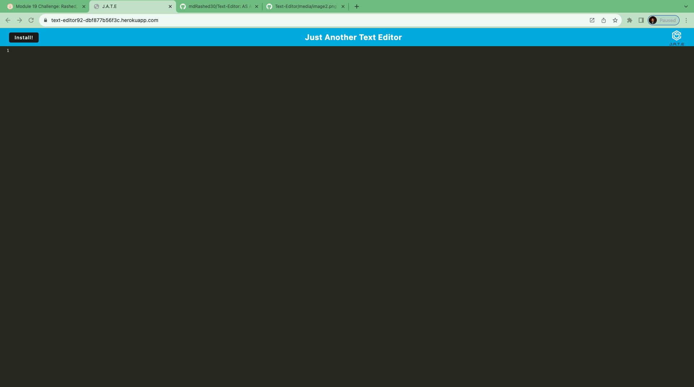

# Text-Editor

## Description

Text-Editor stands as a browser-based text editor, functioning as a Progressive Web Application (PWA) that seamlessly empowers users to create, modify, and manage the text documents. Through the integration of IndexedDB, the application employs advanced data persistence methods, guaranteeing both data redundancy and the ability to operate offline with full functionality.

## Table of Contents

1. [The Task](#the-task)
2. [Install](#install)
3. [Languages Used](#languages-used)
4. [Screenshots](#screenshots)
5. [Heroku](#heroku)
6. [Links](#links)
7. [acknowledgements](#acknowledgements)
8. [credit](#credit)

## The Task

### User Story

- AS A developer
- I WANT to create notes or code snippets with or without an internet connection
- SO THAT I can reliably retrieve them for later use

### Acceptance Criteria

- IVEN a text editor web application
- WHEN I open my application in my editor
- THEN I should see a client server folder structure
- WHEN I run `npm run start` from the root directory
- THEN I find that my application should start up the backend and serve the client
- WHEN I run the text editor application from my terminal
- THEN I find that my JavaScript files have been bundled using webpack
- WHEN I run my webpack plugins
- THEN I find that I have a generated HTML file, service worker, and a manifest file
- WHEN I use next-gen JavaScript in my application
- THEN I find that the text editor still functions in the browser without errors
- WHEN I open the text editor
- THEN I find that IndexedDB has immediately created a database storage
- WHEN I enter content and subsequently click off of the DOM window
- THEN I find that the content in the text editor has been saved with IndexedDB
- WHEN I reopen the text editor after closing it
- THEN I find that the content in the text editor has been retrieved from our IndexedDB
- WHEN I click on the Install button
- THEN I download my web application as an icon on my desktop
- WHEN I load my web application
- THEN I should have a registered service worker using workbox
- WHEN I register a service worker
- THEN I should have my static assets pre cached upon loading along with subsequent pages and static assets
- WHEN I deploy to Heroku
- THEN I should have proper build scripts for a webpack application

## Install

Steps to run Application :

1. Clone this repository
2. Open the terminal and navigate the root directory
3. Install the dependencies
4. Run npm start
5. Open the Localhost 3000

## Languages Used

- HTML
- CSS
- JavaScript
- node.js
- Express.js
- idb
- webpack
- workbox

## Screenshots

## Heroku:

- [Text-Editor](https://text-editor92-dbf877b56f3c.herokuapp.com/)

## Links

- [Github Repo](https://github.com/mdRashed30/Text-Editor)

## Acknowledgements :

-- Video tutorial

-- TA

## Credit:

Special thanks to my friends who help me -

-- Indrojit Ghosh

-- Zuberi Ash
